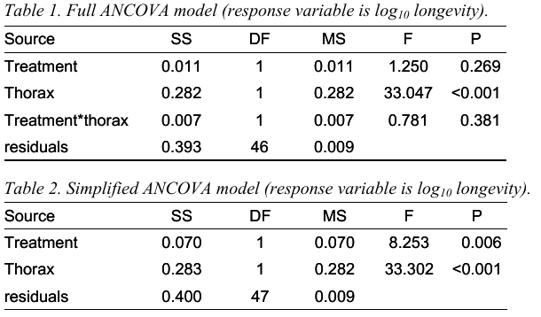

## Problem based learning workshop
### Exercise 1
A student wished to know whether seed production in an invasive plant depends on whether flowers are self-pollinated or cross-pollinated. She knew that seed production increases with plant size, so she measured the sizes of 50 plants before randomly assigning them to selfed and crossed treatments. She applied the treatment (pollen from self vs others) to the stigmas of 5 flowers per plant, and later counted how many seeds each flower produced.

1. _Draw out the experimental design, indicating the number of replicates at each level._

* 25 plants per treatment.
* 5 flowers per plant.

2. _How many independent data points are there?_

* 50. Not 250 because flowers on the same plant are not independent.

3. _How would you deal with the data to ensure that all data points used in the analysis are independent?_

* I would use a plant-level random effect in the analysis.

4. _In the general format (response~predictor variables), write down the full linear model that includes an interaction between the categorical variable and the covariate (i.e., with separate slopes and intercepts fitted for each treatment group). Make sure you can distinguish between these different types of predictor variable._

* `number.of.seeds.in.a.flower ~ treatment * plant.size + (1|plant.id)`

5. _Write down a simplified model that includes the main effects of the predictor variables only._

* `number.of.seeds.in.a.flower ~ treatment + plant.size  + (1|plant.id)`

6. _Sketch a graph (with labelled axes) showing a possible outcome if the full model best explains the data (i.e., if the interaction is significant)._

```{r}
library(ggplot2)
ggplot() + 
	geom_abline(intercept=1, slope=2, color='red') +
	geom_abline(intercept=8, slope=-1.5, color='blue') +
	xlim(1,6) + ylim(1,10) +
	theme_classic() + 
	theme(axis.ticks=element_blank(), axis.text=element_blank(),
		axis.line=element_line(size=1)) +
	xlab('Plant size') + ylab('Number of seeds')
```

7. _Sketch a graph (with labelled axes) showing a possible outcome if the simplified model best explains the data (i.e., if only the main effects are significant)._

```{r}
library(ggplot2)
ggplot() + 
	geom_abline(intercept=1, slope=-1.5, color='red') +
	geom_abline(intercept=8, slope=-1.5, color='blue') +
	xlim(1,6) + ylim(1,10) +
	theme_classic() + 
	theme(axis.ticks=element_blank(), axis.text=element_blank(),
		axis.line=element_line(size=1)) +
	xlab('Plant size') + ylab('Number of seeds')
```

8. _Sketch 2 graphs (with labelled axes) showing a possible outcome if only one of the main effects is significant (do this for each main effect)._


The plot below shows if there is an effect of size.

```{r}
library(ggplot2)
ggplot() + 
	geom_abline(intercept=8, slope=-1.5, color='black') +
	xlim(1,6) + ylim(1,10) +
	theme_classic() + 
	theme(axis.ticks=element_blank(), axis.text=element_blank(),
		axis.line=element_line(size=1)) +
	xlab('Plant size') + ylab('Number of seeds')
```

The plot below shows if there is an effect of treatment.

```{r}
library(ggplot2)
ggplot() + 
	geom_abline(intercept=1, slope=0, color='red') +
	geom_abline(intercept=8, slope=0, color='blue') +
	xlim(1,6) + ylim(1,10) +
	theme_classic() + 
	theme(axis.ticks=element_blank(), axis.text=element_blank(),
		axis.line=element_line(size=1)) +
	xlab('Plant size') + ylab('Number of seeds')
```


### Exercise 2: Exploring the specific assumptions of ANCOVA models
**Are regression slopes similar across groups?**

1. _Which of the models that you wrote down in Exercise 1 tests this assumption?_

* The model that includes the interaction.

2. _Which of your sketched graphs from Exercise 1 represents a violation of this assumption? Note that this violation does not mean that you cannot fit an ANCOVA-like model, but simply means that you cannot simplify it to the "classic" ANCOVA form (i.e., an ANOVA adjusted for the regression of the response variable on the covariate)._

* The presence of non-parallel lines suggests this.

**Are covariate values similar across groups (i.e., are the covariate and categorical predictor independent)?**

3. _State whether the experimental design described in Exercise 1 is likely to meet this assumption and why._

* We want overlap between the size ranges for each treatment, otherwise comparisons are extrapolated. Yes, because the plants are randomly assigned to treatments and because the size is measured before the treatments are assigned.

4. _A student was investigating the effects of grazing and soil nutrients on the growth of an invasive grass species. He established 20 plots containing the grass across Queensland. In each plot, he measured grass growth, soil nutrients and grazing intensity (scored as high or low). State whether the experimental design is likely to meet this assumption and why._

* No. There is a correlation between graziing history and grass growth. This is because cows won't eat grass in places where there is no grass. This is called collinearity.

5. _How would you check this assumption in each case?_

* Graph the data. Visualise it.

### Exercise 3: Biological interpretation of ANCOVA models

#### Case study 1
Two researchers wished to know whether if increased reproduction reduces the longevity of male fruit-flies (it does in female fruit-flies). They manipulated reproduction by supplying each of 25 male flies with 1 virgin (receptive) female per day until he died, and each of 25 males flies with 1 newly-inseminated (unreceptive) female per day until he died. They also measured the thorax length of each male, in case it explained some of the variation in longevity.




1. _Do the data meet the specific assumption of ANCOVA that covariate values are similar across groups?_

* Yeah, the red and blue points overlap on the x-axis a lot.

2. _Do the data meet the specific assumption of ANCOVA that regression slopes are similar across groups?_

* The regression slopes are slimialr across groups.

3. _State which ANCOVA model best explains the data (the full model in Table 1, or the simplified model in Table 2) and why._

* The model without the interaction. 

4. _What is the biological interpretation of these results?_

* There is a main effect of mating frequency on longevity. This effect is still significant even if we account for the effect of thorax.

#### Case study 2
Shrinking of the test (i.e., endoskeleton) is reported in some species of sea urchins when food is in short supply. These tests consist of calcareous plates joined by sutures, which might allow tests some degree of elasticity (much like human skulls) and explain this reduction in size. A researcher studied the role of suture width in the shrinking of sea urchin tests on different diets. He manipulated diet by maintaining 24 urchins in a low food treatment (with food depleted below natural levels) and 24 urchins in a control treatment (with food at natural levels). He also measured the initial body volume of each urchin, in case it explained some of the variation in suture width.


1. _Do the data meet the specific assumption of ANCOVA that regression slopes are similar across groups?_

* Yes. The data for each treatment overlaps on the x-axis.

2. _State which ANCOVA model best explains the data (the full model in Table 3, or the simplified model in Table 4) and why._

* The model with the interaction (Table 3).

3. _What is the biological interpretation of these results?_

* The effect of treatment on suture width depends on initial body volume. You cannot predict what the effect of treatment is unless you know the initial body volume.

## \texttt{R} practical session
### General notes


